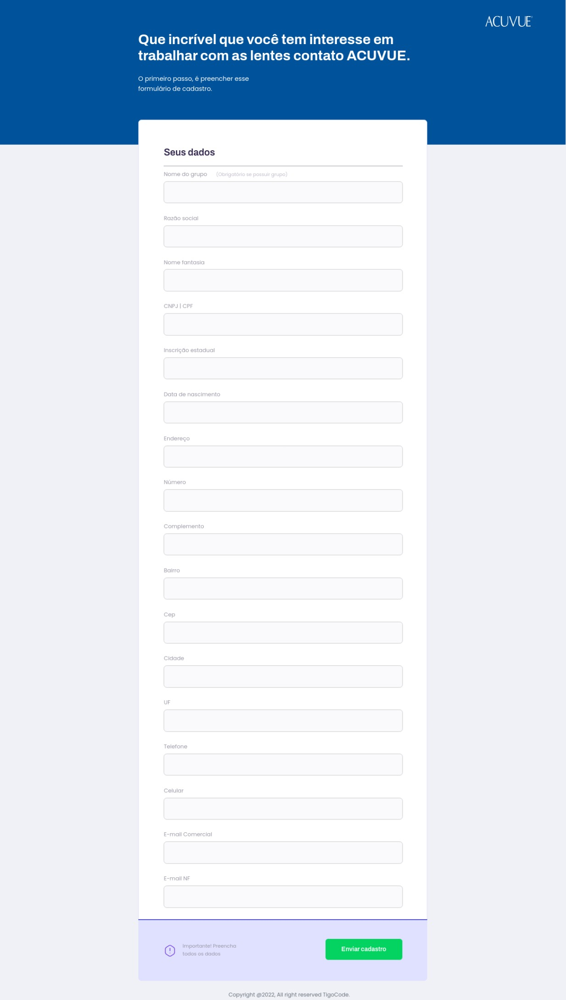

# Formulario de Cadastro ACUVUE - Front-end

> Projeto Pessoal

O projeto teve como finalidade criar uma pagina completa que permita os possivéis clientes ACUVUE possam efetuar a solicitação de cadastro de parceira.

O processo antes era feito através de uma planilha de excel enviada por e-mail, processo que exigia a necessidade do um uso do computador para completar a solicitação.

Com uma pagina web o prospecte pode faze-lo de qualquer lugar, usando o dispositivo que estiver na mão.

[ 🔗 Clique aqui para acessar](https://sejaacuvue.netlify.app/)

## 🚀 Tecnologias

- HTML
- CSS
- Git e Github

## 🚀 Contato
TDantas@tigocode.com.br